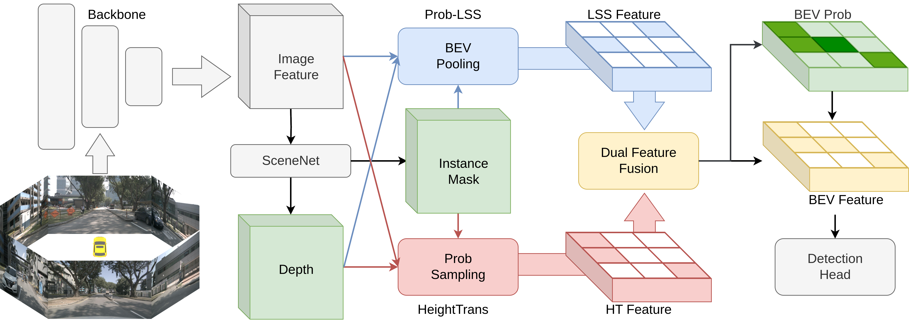

# DualBEV

<!-- ## Introduction -->
This repository is an official implementation of [DualBEV](https://arxiv.org/abs/2403.05402).

If you find this work interesting, please do not hesitate to give a ⭐!

<p align="center">

</p>

## News

- **2024.07.01** DualBEV is accepted to ECCV 2024. 🎉
- **2024.07.01** Code of DualBEV is released. 🚀
- **2024.04.22** Blog in Chinese [Zhihu](https://zhuanlan.zhihu.com/p/688261486).🔥
- **2024.03.08** Paper of DualBEV available in [arxiv](https://arxiv.org/abs/2403.05402).

## Main Results

| Config                                                                    | Frames           | mAP        | NDS        | Model                                                                                          | Log                                                                                            |
| ------------------------------------------------------------------------- | ---------- | ---------- | ---------- | ---------------------------------------------------------------------------------------------- | ---------------------------------------------------------------------------------------------- |
| [**DualBEV-R50-CBGS**](configs/dualbev/dualbev-r50-cbgs.py)                  | <p align="center">1 | 36.8       | 43.4       | [google](https://drive.google.com/drive/folders/15VIJDJyqnzTJJYGKgj4AQcWe9ZPslYkz?usp=drive_link) / [baidu](https://pan.baidu.com/s/1enTKsWlu_MRonSFthnjDaw?pwd=7umw) | [google](https://drive.google.com/drive/folders/15VIJDJyqnzTJJYGKgj4AQcWe9ZPslYkz?usp=drive_link) / [baidu](https://pan.baidu.com/s/1xVmKpfZc23tZayLXKb3KpQ?pwd=m17p) |
| [**DualBEV-R50-4D-CBGS**](configs/dualbev/dualbev4d-r50-cbgs.py) | <p align="center">2 | 38.6 | 50.5 | [google](https://drive.google.com/drive/folders/15VIJDJyqnzTJJYGKgj4AQcWe9ZPslYkz?usp=drive_link) / [baidu](https://pan.baidu.com/s/14Z3dWwI3_d-_8VBUqQ7kVg?pwd=qbmn) | [google](https://drive.google.com/drive/folders/15VIJDJyqnzTJJYGKgj4AQcWe9ZPslYkz?usp=drive_link) / [baidu](https://pan.baidu.com/s/1RUuajCBRjOxHKfb_I6kh2w?pwd=p3wy) |

## Get Started

#### Installation and Data Preparation

1. Please refer to [getting_started.md](docs/en/getting_started.md) for installing DualBEV as mmdetection3d. [Docker](docker/Dockerfile) is recommended for environment preparation.
2. Prepare nuScenes dataset as introduced in [nuscenes_det.md](docs/en/datasets/nuscenes_det.md) and create the pkl for DualBEV by running:

```shell
python tools/create_data_bevdet.py
```
3. Download nuScenes-lidarseg from nuScenes official site and put it under data/nuscenes/. Create depth and semantic labels from point cloud by running:

```shell
python tools/generate_point_label.py
```
#### Train and Test
Single-Frame:
```shell
bash tools/dist_train.sh configs/dualbev/dualbev-r50-cbgs.py 8 --no-validate
bash tools/dist_test.sh configs/dualbev/dualbev-r50-cbgs.py  work_dirs/dualbev-r50-cbgs/epoch_20_ema.pth 8 --eval mAP
```
Multi-Frame:
```shell
bash tools/dist_train.sh configs/dualbev/dualbev4d-r50-cbgs.py 8 --no-validate
bash tools/dist_test.sh configs/dualbev/dualbev4d-r50-cbgs.py  work_dirs/dualbev4d-r50-cbgs/epoch_20_ema.pth 8 --no-aavt --eval mAP
```

## Acknowledgement

This project is not possible without multiple great open-sourced code bases. We list some notable examples below.

- [open-mmlab](https://github.com/open-mmlab)
- [CenterPoint](https://github.com/tianweiy/CenterPoint)
- [Lift-Splat-Shoot](https://github.com/nv-tlabs/lift-splat-shoot)
- [BEVDet](https://github.com/HuangJunJie2017/BEVDet)
- [BEVDepth](https://github.com/Megvii-BaseDetection/BEVDepth)
- [SA-BEV](https://github.com/mengtan00/SA-BEV)
- [FB-BEV](https://github.com/NVlabs/FB-BEV)
- [AFF](https://github.com/YimianDai/open-aff)

## Bibtex

If this work is helpful for your research, please consider citing the following BibTeX entry.

```
@article{li2024dualbev,
      title={DualBEV: CNN is All You Need in View Transformation}, 
      author={Peidong Li and Wancheng Shen and Qihao Huang and Dixiao Cui},
      journal={arXiv preprint arXiv:2403.05402},
      year={2024},
}
```
